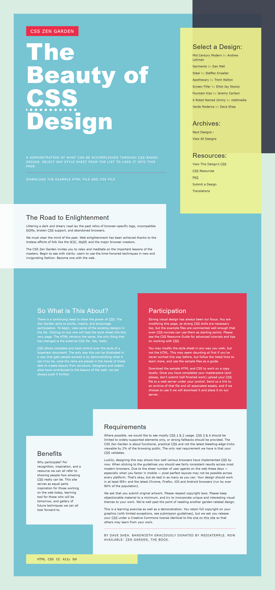

Web Challenge 01
==========

Take a look at the webpage located in the ```ictgradschool/web/challenge01``` folder. Here, you'll see a website whose stylesheet (```style.css```) has had a number of ```margin```, ```padding```, ```position```, ```float```, and ```width``` properties removed from its elements. Modify ```style.css``` so that the webpage looks as close as possible to the screenshot shown below. 

##### NOTE:
23 properties were removed from the CSS. You can use this number as a guide, but need not seek to add exactly that many properties back however, as it is possible to find alternate solutions that lead to the same layout.